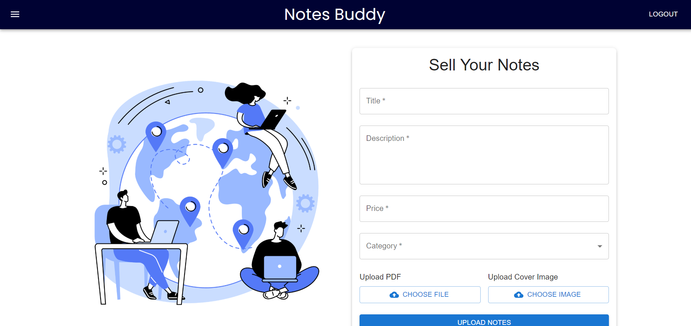

# **NotesBuddy**

### **E-Commerce Platform for Academic Notes**
A web platform designed to simplify the buying and selling of academic notes. This application provides secure authentication, an interactive user interface, and scalable backend support to ensure a seamless experience.
<center>

</center>
 
 **Full-Stack Django React Web Application**

## **Features**
- **E-Commerce for Notes:**  
  A platform where users can sell and purchase academic notes effortlessly.

- **Secure Authentication:**  
  Integrated **JWT authentication** for secure and reliable user access.

- **Interactive UI:**  
  Designed a user-friendly interface leveraging **ReactJS** and **Material-UI (MUI)** for an engaging experience.

- **Backend Development:**  
  Built a scalable and efficient backend using **Django**.

- **Full-Stack Integration:**  
  Delivered a responsive and robust full-stack application with excellent performance.

---

## **Screenshots**

### **Home Page**  


### **Login Page**  
*JWT Authentication Login*  


### **Upload Notes to sell**  
*Page where users can upload notes for sale.*  
 

### **Uploaded Notes for Sale**  
*Page where users can upload and list notes for sale.*  


### **Store Page**  
*Page where users can browse and buy available notes.*  


### **Cart Page**  
*Page showing selected notes ready for checkout.*  


### **Checkout Page**  
*Page to complete the purchase (Payment integration pending).*  


---

## **Pending Features**
- **Payment Integration:**  
  *Work in progress. Currently, the payment process is not completed.*

---

## **Technologies Used**
- **Frontend:** ReactJS, Material-UI (MUI)  
- **Backend:** Django
- **Database** SQL
- **Authentication:** JSON Web Tokens (JWT)

---

## **How to Run Locally**
1. Clone the repository:
   ```bash
   git clone git@github.com:ranasuryansh14/GetUrNotes.git
2. Navigate to the project folder
3. Install Dependencies
4. Start the server
